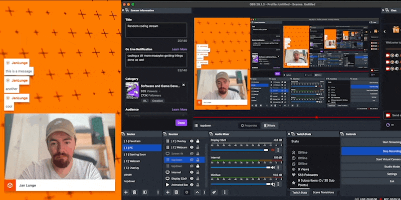
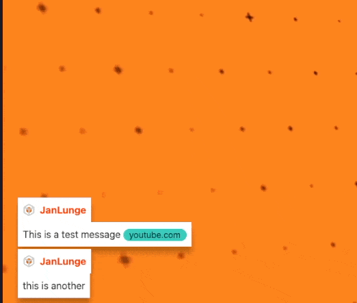
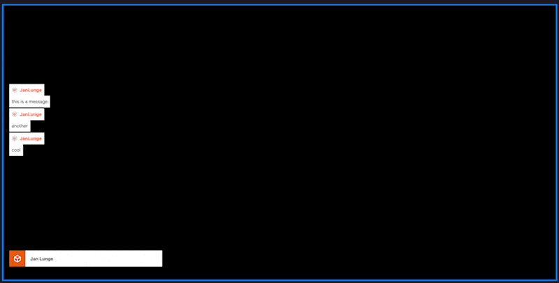

# twitch-overlay

a twitch overlay in vue3 with chat, alerts, mouse tracking and obs integration
checkout the backend for this bot at [witch-bot](https://github.com/JanLunge/witchBot)

## features

### automatic starting soon timer
when you select the starting soon scene a timer will automatically start counting down from 5 minutes


### chat
fully animated chat with automatic link shortening only showing the domain on stream


### facecam chat expand
when you click on the facecam the chat will expand to show more messages


### alerts
alerts for follows, subs, bits and raids with custom sounds will slide through in the bottom left corner


### mouse tracking
if you have a large monitor like a 32x9 you can split it into 4 1280x1440 sections and only show the one that your cursor is on


# setup
its expected you have the obs websockets plugin installed and running on port 4444 with password `obslocal` [obswebsocket plugin](https://github.com/obsproject/obs-websocket/releases)
`yarn`
`yarn dev`
then point the obs source to the url in the console

scene names are 
```
[ S ] FaceCam
[ S ] Starting Soon
[ S ] PC
    Display 32x9
```

add the overlay as a source once to a seperate scene and then place that scene in every other scene you want to use the overlay in